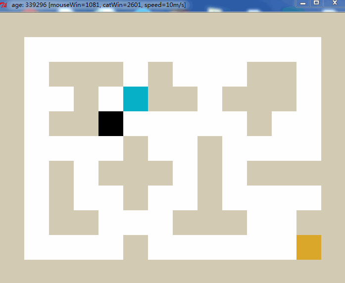

# Secure-MultiParty-Computation


# Project présentation 

This project has been realized in the frame of my Artificial Intelligence and Machine Learning master project.

Criteo is a French ad retargeting company with revenues of €2 billion, serving over 4 billion ads every day.

The objective of the project (research oriented) is to evaluate the relevance, for the Machine Learning domain, of the cryptographic method called Secure Multiparty Computation (sMPC) in the context of a Federative Learning method on a bandit algorithm.

## The main questions are:
- Does this method increase the accuracy of the models?
- Does this method consume less energy? (Data not exported to the cloud).
- What are the limitations of this method?

We rely on the open-source library Crypten. It is a framework built on PyTorch to facilitate secure and privacy-preserving machine learning search. Crypten implements the sMPC method, which encrypts information by splitting the data between multiple parties, each of which can perform computations on their share but are not able to read the original data. 

## 📌 The strategy used is to confront the following 3 models: 
- Q-Learning Bandits Algorithm
- Learning algorithm trained via Federated Learning
- Learning algorithm trained via Federated Learning with sMPC method

## Reproduce it yourself

```bash
git clone https://github.com/fancoo/QLearningMouse
cd QLearningMouse
python greedyMouse.py
```

The simulation parameters can be modified from the config.py file where:
- **number_of_worlds** : number of mice/worlds generated in parallel
- **learning_mode_index** : learning type among Tabular Q-Learning / Deep QLearning / Federated Deep QLearning
- **MAX_AGE** : number of iterations


# Project Results

Our project was very short in time and we didn't have access to a powerful calculation system. We didn't have the time to run all the learning methods on 300k iterations where we should see the learning effect of the mouse (at least in tabular Q-Learning mode). Your can find below the results given by 20k iterations where it's normal to don't see the learning effect.


Hence, in order to display some results on time, we decided to adapt the task to be done and we implemented a simple MNIST classification task. You can find below the results on the first iterations.


You can check out the report for further details about the project

## Possible improvements
- Reducing the number of agents interacting throught sMPC might accelerate calculations (create pre-aggregation step)
- Find better Q-Learning regression model architecture


# Original QLearningMouse (tabular Q-Learning)

<b>QLearningMouse</b>  is a small cat-mouse-cheese game based on [Q-Learning](https://en.wikipedia.org/wiki/Q-learning). The original version is by [vmayoral](https://github.com/vmayoral): [basic_reinforcement_learning:tutorial1](https://github.com/vmayoral/basic_reinforcement_learning/tree/master/tutorial1), I reconstructed his code to make the game more configurable, and what different most is that I use breadth-first-search([BFS](https://en.wikipedia.org/wiki/Breadth-first_search)) when cat chasing the AI mouse, so the cat looks much more brutal.

## About the game
Cat always chase the mouse in the shortest path, however the mouse first does not know the danger of being eaten. 
* <b>Mouse win</b> when eating the cheese and earns rewards value of 50, then a new cheese will be produced in a random grid.
* <b>cat win</b> when eating the mouse, the latter will gain rewards value of -100 when dead. Then it will relive in a random grid.

## Algorithm  
The basic algorithm of Q-Learning is:  
```
Q(s, a) += alpha * (reward(s,a) + gamma * max(Q(s', a') - Q(s,a))
#UPDATE TO CONTEXTUAL BANDITS
```
    
```alpha``` is the learning rate.
```gamma``` is the value of the future reward.
It use the best next choice of utility in later state to update the former state. 

Learn more about Q-Learning:  
1. [The Markov Decision Problem : Value Iteration and Policy Iteration](http://ais.informatik.uni-freiburg.de/teaching/ss03/ams/DecisionProblems.pdf)  
2. [ARTIFICIAL INTELLIGENCE FOUNDATIONS OF COMPUTATIONAL AGENTS : 11.3.3 Q-learning](http://artint.info/html/ArtInt_265.html)


## Example
Below we present a *mouse player* after **300 generations** of reinforcement learning:  
* blue is for mouse.
* black is for cat.
* orange is for cheese.


After **339300 generations**:  



